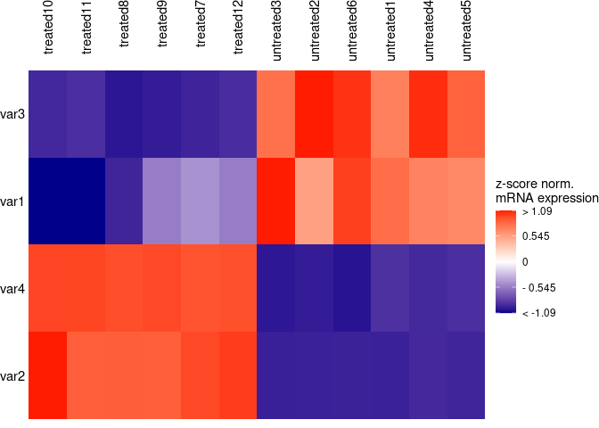
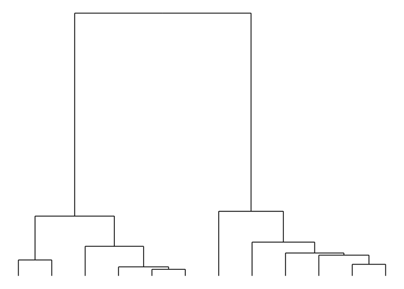
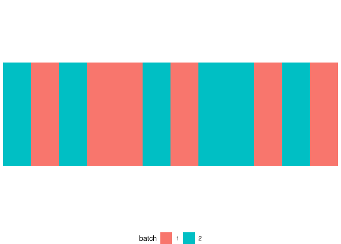

<!-- README.md is generated from README.Rmd. Please edit that file -->

# simpleHM

<!-- badges: start -->
<!-- badges: end -->

The goal of simpleHM is to …

## Installation

You can install the development version of simpleHM from
[GitHub](https://github.com/) with:

``` r
# install.packages("devtools")
devtools::install_github("jaspitzer/simpleHM")
```

## Example

This is a basic example which shows you how to solve a common problem:

``` r
library(simpleHM)

df <- data.frame(samples = c(paste0("untreated", 1:6), paste0("treated", 7:12)),
                 group = c(rep("Untreated",6), rep("Treated",6)),
                 patient = c(rep(paste0("Patient", 1:3), 4)),
                 batch = rep(1:2, 6),
                 var1 = c(rnorm(6, 10, 1),  rnorm(6, 7, .7)),
                 var2 = c(rnorm(6, 10, 1),  rnorm(6, 200, 10)),
                 var3 = c(rnorm(6, 50, 5),  rnorm(6, 10, 1)),
                 var4 = c(rnorm(6, 10, 1),  rnorm(6, 60, .7)))

head(df)
#>      samples     group  patient batch      var1      var2     var3      var4
#> 1 untreated1 Untreated Patient1     1 10.503050 10.347042 50.68064  9.169438
#> 2 untreated2 Untreated Patient2     2 10.880663  8.937040 55.38670 10.763202
#> 3 untreated3 Untreated Patient3     1  8.624365  8.497992 56.53160  7.617076
#> 4 untreated4 Untreated Patient1     2  8.183576 11.835800 56.09138  9.927114
#> 5 untreated5 Untreated Patient2     1 10.656797 11.880149 52.04441  8.445013
#> 6 untreated6 Untreated Patient3     2 11.007595 10.372460 38.68375 10.470105

heatmap_plot <- simpleHM(df, excluded_vars = "batch")    
heatmap_plot
```



By default the sample names for \<50 samples or \>100 params are hidden.
You can also hide them by using the `show_sample_names` and
`show_param_names` arguments.

``` r
heatmap_plot_no_sample_names <- simpleHM(df, excluded_vars = "batch", show_sample_names = F)    
heatmap_plot_no_sample_names
```


``` r
heatmap_plot_no_param_names <- simpleHM(df, excluded_vars = "batch", show_param_names = F)    
heatmap_plot_no_param_names
```


You can also add Annotation bars for several of the conditions by using
the `add_annotation` parameter:

``` r
hm_with_anno <- simpleHM(df, add_annotation = T, anno_col = c("group", "patient"), excluded_vars = "batch")
hm_with_anno
```


By default, the samples and parameters are clustered. To display the
dendrograms, set `add_dendros=T`.

``` r
hm_with_dendro <- simpleHM(df, excluded_vars = "batch", add_dendros = T)
```

Dendrograms are a for to visualise hierarchical clustering, but the
branches can be rotated freely, without a change in clustering or
distance between branches. For this purpose, the `pull_top` and
`pull_side` arguments can be used to “pull” certain samples to the front
through rotation along the branches of the tree.

``` r


library(patchwork)
p1 <- simpleHM(df, excluded_vars = "batch", add_dendros = T, hide_legend = T)
p2 <- simpleHM(df, excluded_vars = "batch", add_dendros = T, pull_top = 7:12, hide_legend = T)
p3 <- simpleHM(df, excluded_vars = "batch", add_dendros = T, pull_side = 3:4, hide_legend = T)
p4 <- simpleHM(df, excluded_vars = "batch", add_dendros = T, pull_side = c("var1", "var3"), hide_legend = T)

combined_plots1 <- wrap_plots(list(p1, p2), ncol = 2)
combined_plots2 <- wrap_plots(list(p3, p4), ncol = 2)

combined_plots1 
```


``` r
combined_plots2
```


These options can also be combined:

``` r
annotated_hm_with_dendro <- simpleHM(df, excluded_vars = "batch", add_annotation = T, anno_col = c("group", "patient"), add_dendros = T)
annotated_hm_with_dendro
```


You can also generate the separate parts like the heatmap, the
dendrogram and the annotation seperately and later combine them in a way
you see fit.

``` r
just_dendros <- simpleDendro(df, excluded_vars = "batch")
just_dendros
#> $top
```



    #> 
    #> $side


``` r
just_annotations <- simpleAnno(df, excluded_vars = "batch")
just_annotations
#> $batch
```



    #> 
    #> $patient


    #> 
    #> $group

 As a
note, the `excluded_vars` argument excludes the (numeric) variable from
influence in clustering and normalisation, it does not exclude it from
the annotation columns. You can however specify the columns through the
`annotation_cols` parameter:

``` r
specific_annotations <- simpleAnno(df, anno_col = c("group", "patient"))
specific_annotations
#> $patient
```


    #> 
    #> $group


