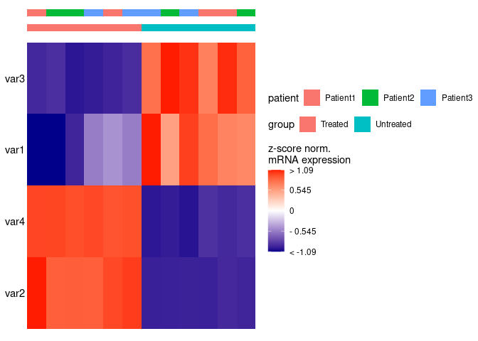
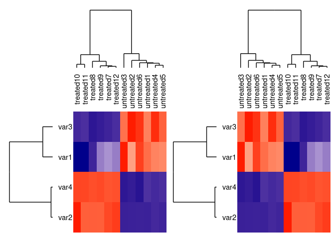
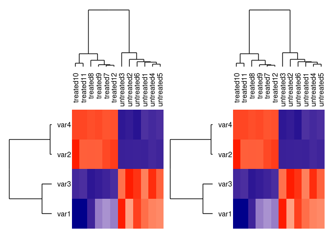

<!-- README.md is generated from README.Rmd. Please edit that file -->

# simpleHM

<!-- badges: start -->
<!-- badges: end -->

The goal of simpleHM is to …

## Installation

You can install the development version of simpleHM from
[GitHub](https://github.com/) with:

``` r
# install.packages("devtools")
devtools::install_github("jaspitzer/simpleHM")
```

## Example

This is a basic example which shows you how to solve a common problem:

``` r
library(simpleHM)

df <- data.frame(samples = c(paste0("untreated", 1:6), paste0("treated", 7:12)),
                 group = c(rep("Untreated",6), rep("Treated",6)),
                 patient = c(rep(paste0("Patient", 1:3), 4)),
                 batch = rep(1:2, 6),
                 var1 = c(rnorm(6, 10, 1),  rnorm(6, 7, .7)),
                 var2 = c(rnorm(6, 10, 1),  rnorm(6, 200, 10)),
                 var3 = c(rnorm(6, 50, 5),  rnorm(6, 10, 1)),
                 var4 = c(rnorm(6, 10, 1),  rnorm(6, 60, .7)))

head(df)
#>      samples     group  patient batch      var1      var2     var3      var4
#> 1 untreated1 Untreated Patient1     1 10.383453  9.287492 45.79169 11.583357
#> 2 untreated2 Untreated Patient2     2 10.075931 10.270500 45.01411  7.953078
#> 3 untreated3 Untreated Patient3     1 10.483314 10.710035 54.10228 11.249119
#> 4 untreated4 Untreated Patient1     2  9.900946  8.954973 52.03374  8.690800
#> 5 untreated5 Untreated Patient2     1 10.404475  7.736143 44.07323 10.329316
#> 6 untreated6 Untreated Patient3     2  9.720149  9.675822 42.67871 10.274727

heatmap_plot <- simpleHM(df, excluded_vars = "batch")    
#> normalisation done
#> clustering samples done
#> clustering params done
#> plotting now
heatmap_plot
```


By default the sample names for \<50 samples or \>100 params are hidden.
You can also hide them by using the `show_sample_names` and
`show_param_names` arguments.

``` r
heatmap_plot_no_sample_names <- simpleHM(df, excluded_vars = "batch", show_sample_names = F)    
#> normalisation done
#> clustering samples done
#> clustering params done
#> plotting now
heatmap_plot_no_sample_names
```


``` r
heatmap_plot_no_param_names <- simpleHM(df, excluded_vars = "batch", show_param_names = F)    
#> normalisation done
#> clustering samples done
#> clustering params done
#> plotting now
heatmap_plot_no_param_names
```


You can also add Annotation bars for several of the conditions by using
the `add_annotation` parameter:

``` r
hm_with_anno <- simpleHM(df, add_annotation = T, anno_col = c("group", "patient"), excluded_vars = "batch")
#> normalisation done
#> clustering samples done
#> clustering params done
#> plotting now
#> adding annotation
#> wrapping plots up
hm_with_anno
```



By default, the samples and parameters are clustered. To display the
dendrograms, set `add_dendros=T`.

``` r
hm_with_dendro <- simpleHM(df, excluded_vars = "batch", add_dendros = T)
#> normalisation done
#> clustering samples done
#> clustering params done
#> plotting now
#> Scale for y is already present.
#> Adding another scale for y, which will replace the existing scale.
#> Scale for x is already present.
#> Adding another scale for x, which will replace the existing scale.
```

Dendrograms are a for to visualise hierarchical clustering, but the
branches can be rotated freely, without a change in clustering or
distance between branches. For this purpose, the `pull_top` and
`pull_side` arguments can be used to “pull” certain samples to the front
through rotation along the branches of the tree.

``` r


library(patchwork)
p1 <- simpleHM(df, excluded_vars = "batch", add_dendros = T )
#> normalisation done
#> clustering samples done
#> clustering params done
#> plotting now
#> Scale for y is already present.
#> Adding another scale for y, which will replace the existing scale.
#> Scale for x is already present.
#> Adding another scale for x, which will replace the existing scale.
p2 <- simpleHM(df, excluded_vars = "batch", add_dendros = T, pull_top = 7:12)
#> normalisation done
#> clustering samples done
#> clustering params done
#> plotting now
#> Scale for y is already present.
#> Adding another scale for y, which will replace the existing scale.Scale for x is already present.
#> Adding another scale for x, which will replace the existing scale.
p3 <- simpleHM(df, excluded_vars = "batch", add_dendros = T, pull_side = 3:4)
#> normalisation done
#> clustering samples done
#> clustering params done
#> plotting now
#> Scale for y is already present.
#> Adding another scale for y, which will replace the existing scale.Scale for x is already present.
#> Adding another scale for x, which will replace the existing scale.
p4 <- simpleHM(df, excluded_vars = "batch", add_dendros = T, pull_side = c("var1", "var3"))
#> normalisation done
#> clustering samples done
#> clustering params done
#> plotting now
#> Scale for y is already present.
#> Adding another scale for y, which will replace the existing scale.Scale for x is already present.
#> Adding another scale for x, which will replace the existing scale.

combined_plots1 <- wrap_plots(list(p1, p2), ncol = 2) & ggplot2::theme(legend.position = "none")
combined_plots2 <- wrap_plots(list(p3, p4), ncol = 2, guides = "collect")

combined_plots1
```



``` r
combined_plots2
```



These options can also be combined:

``` r
annotated_hm_with_dendro <- simpleHM(df, excluded_vars = "batch", add_annotation = T, anno_col = c("group", "patient"), add_dendros = T)
#> normalisation done
#> clustering samples done
#> clustering params done
#> plotting now
#> adding annotation
#> wrapping plots up
#> Scale for y is already present.
#> Adding another scale for y, which will replace the existing scale.
#> Scale for x is already present.
#> Adding another scale for x, which will replace the existing scale.
annotated_hm_with_dendro
```


