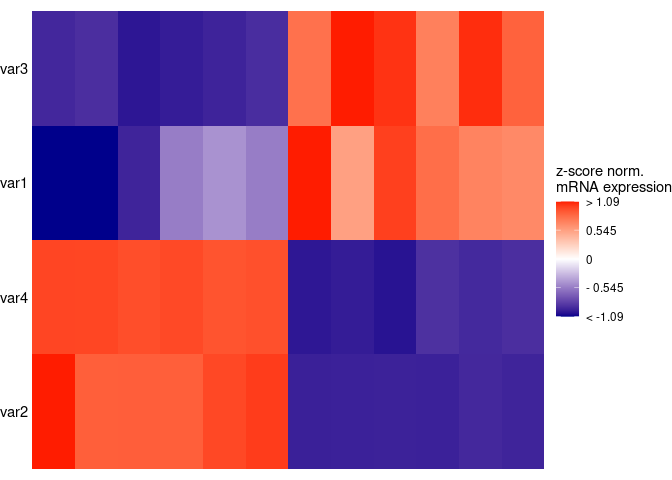

<!-- README.md is generated from README.Rmd. Please edit that file -->

# simpleHM

<!-- badges: start -->
<!-- badges: end -->

The goal of simpleHM is to …

## Installation

You can install the development version of simpleHM from
[GitHub](https://github.com/) with:

``` r
# install.packages("devtools")
devtools::install_github("jaspitzer/simpleHM")
```

## Example

This is a basic example which shows you how to solve a common problem:

``` r
library(simpleHM)
df <- data.frame(samples = c(paste0("untreated", 1:6), paste0("treated", 7:12)),
                 group = c(rep("Untreated",6), rep("Treated",6)),
                 patient = c(rep(paste0("Patient", 1:3), 4)),
                 batch = rep(1:2, 6),
                 var1 = c(rnorm(6, 10, 1),  rnorm(6, 7, .7)),
                 var2 = c(rnorm(6, 10, 1),  rnorm(6, 200, 10)),
                 var3 = c(rnorm(6, 50, 5),  rnorm(6, 10, 1)),
                 var4 = c(rnorm(6, 10, 1),  rnorm(6, 60, .7)))

heatmap_plot <- simpleHM(df, excluded_vars = "batch")    
#> normalisation done
#> clustering samples done
#> clustering params done
#> plotting now
heatmap_plot
```


You can also add Annotaiton bars for several of the conditions by using
the `add_annotation` parameter:

``` r
hm_with_anno <- simpleHM(df, add_annotation = T, anno_col = c("group", "patient"), excluded_vars = "batch")
#> normalisation done
#> clustering samples done
#> clustering params done
#> plotting now
#> adding annotation
#> wrapping plots up
hm_with_anno
```



By default, the samples and parameters are clustered. To display the
dendrograms, set `add_dendros=T`.

``` r
hm_with_dendro <- simpleHM(df, excluded_vars = "batch", add_dendros = T)
#> normalisation done
#> clustering samples done
#> clustering params done
#> plotting now
#> Scale for y is already present.
#> Adding another scale for y, which will replace the existing scale.
#> Scale for x is already present.
#> Adding another scale for x, which will replace the existing scale.
```

These options can also be combined:

``` r
annotated_hm_with_dendro <- simpleHM(df, excluded_vars = "batch", add_annotation = T, anno_col = c("group", "patient"), add_dendros = T)
#> normalisation done
#> clustering samples done
#> clustering params done
#> plotting now
#> adding annotation
#> wrapping plots up
#> Scale for y is already present.
#> Adding another scale for y, which will replace the existing scale.
#> Scale for x is already present.
#> Adding another scale for x, which will replace the existing scale.
annotated_hm_with_dendro
```


